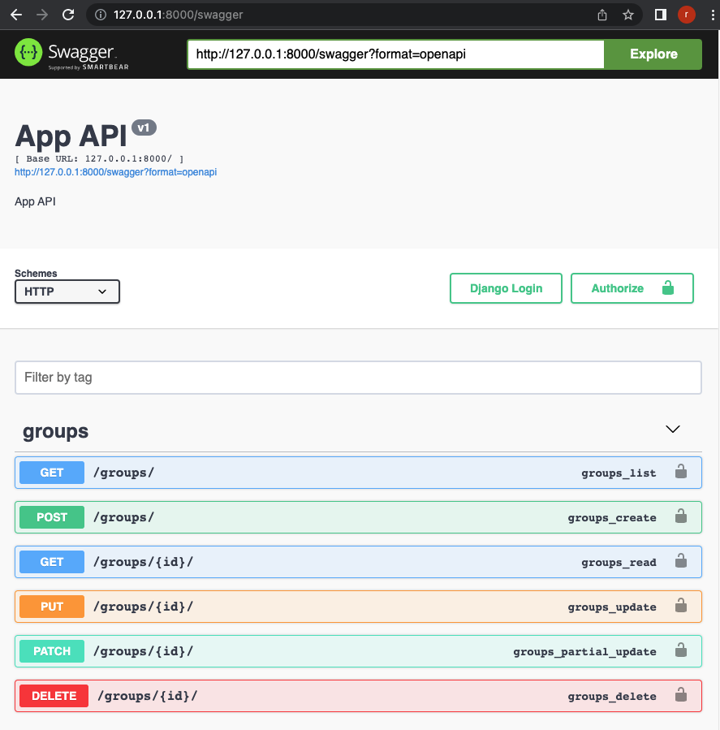
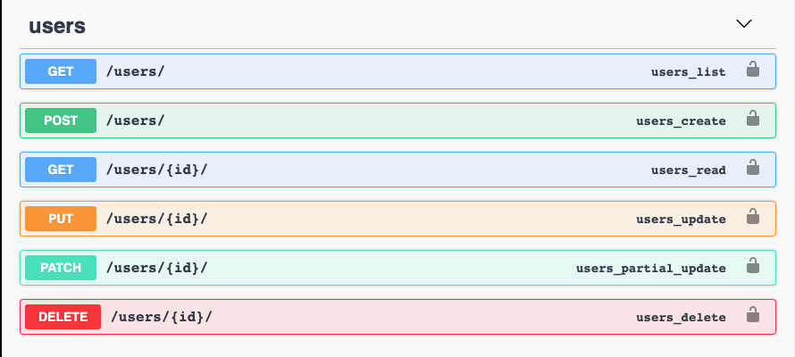
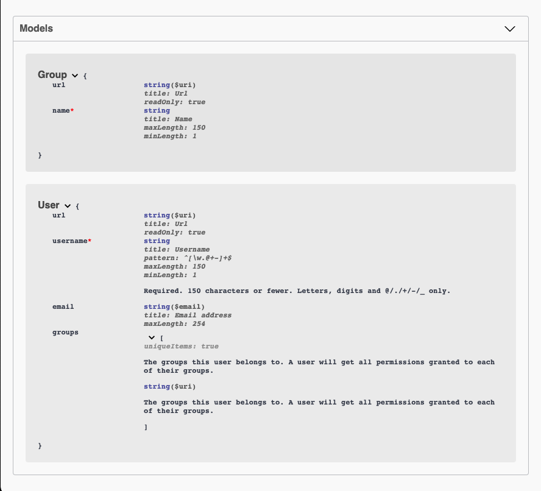

# DRF(Django REST framework) OpenAPI Specification(Swagger)
Reference: 
- [Django REST framework Quickstart](https://www.django-rest-framework.org/tutorial/quickstart/)
- [drf-yasg](https://drf-yasg.readthedocs.io/en/stable/)

This example is using [DRF Minimal](https://github.com/taptorestart/python-backend-examples/tree/main/drf/drf_minimal).


## Install
```shell
$ python3 -m venv venv
$ source ./venv/bin/activate
$ pip install -r requirements.txt
```

## Migration
```shell
$ python manage.py migrate
```

## For swagger
project/settings.py
```python
INSTALLED_APPS = [
    ...
    'drf_yasg',
]
```

project/urls.py
```python

# Swagger API
schema_view = get_schema_view(
    openapi.Info(
        title="App API",
        default_version="v1",
        description="App API",
    ),
    public=True,
    permission_classes=(permissions.AllowAny,),
)

# swagger url
urlpatterns += [
    re_path(r'^swagger(?P<format>\.json|\.yaml)$', schema_view.without_ui(cache_timeout=0), name="schema-json"),
    re_path(r'^swagger', schema_view.with_ui('swagger', cache_timeout=0), name='schema-swagger-ui'),
    re_path(r'^redoc/$', schema_view.with_ui('redoc', cache_timeout=0), name='schema-redoc'),
]
```

## Run
```shell
$ python manage.py runserver
```

Open your browser at '[http://127.0.0.1:8000/swagger](http://127.0.0.1:8000/swagger)'

## Screenshots
You can see Open API documents.






